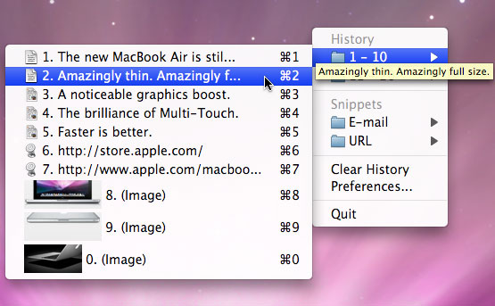

ClipMenu
========
A clipboard manager for Mac OS X.

Target environments
-------------------

* Mac OS X 10.5 - 10.6
* Xcode 3.2
* Manual reference counting

Dependencies
------------
The source code is dependent on some libraries. You have to download and install them if you want to compile, run, or test the source code.

* [PTHotKey](http://www.rogueamoeba.com/utm/posts/Random/Homegrown_Developer_Tools-2004-07-14-12-00) by Quentin D. Carnicelli
* [Shortcut Recorder](http://code.google.com/p/shortcutrecorder/) by contributors to ShortcutRecorder
* [Sparkle](http://sparkle.andymatuschak.org/) by Andy Matuschak
* [DBPrefsWindowController](http://www.mere-mortal-software.com/blog/sourcecode.php) by Dave Batton
* [Google Toolbox for Mac](http://code.google.com/p/google-toolbox-for-mac/) by Google Inc.
* [BWToolkit](http://www.brandonwalkin.com/bwtoolkit/) by Brandon Walkin

Author
------

Naotaka Morimoto ([@naotakaM](http://twitter.com/naotakaM))

License
-------
ClipMenu is available under the MIT license. See the LICENSE file for more info.
